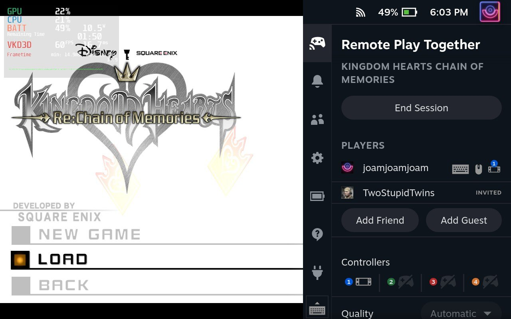

# Remote Play Together Decky Loader Plug-in

Uses [Remote Play Whatever](https://github.com/m4dEngi/RemotePlayWhatever) to create Remote Play Together Sessions for games that don't natively support it.

## Starting a Remote Play Together Session:

1. If you do not have Brawlhalla in your steam library, add it using the steam store. (Its free.)
2. Using the plugin UI in the QAM (...) add your friend using the Add Friend Button.
3. Add a Nickname for your friend and their Steam ID64. [Get Steam ID64](https://steamid.io)
4. Start any game without native RPT support.
5. Uiding the plugin UI Select your friend that you added and select the Start Remote Play Session Button
6. Your friend will be sent an invitation link via steam chat.
7. Have your friend accept the invitation and they should be added to the session.

## Ending a Remote Play Session

1. Use the Remote Play Together UI in the QAM (...) select "End Session"
2. The session will end and you can close your game without issues.
3. Closing a game without first ending the session as the host might cause the steam UI to freeze. See Known Issues below.

Known Issues being worked on in Remote Play Whatever:
* (Client Device) Games that do not run in proton (Yuzu, retroarch etc.) send no sound to the client.
* (Host Device) Steam Deck may freeze of you do not end the session in the QAM before closing the game on the host.
* (Both) Do not tab out of the game or the client controls will stop working until the session is ended and restarted.
* (Both) Cant change donor game App ID (Must use Brawlhalla). (coming in v2)

Note: This is a plugin for the Decky Loader. You must have it installed to use this plug-in.

[Install Decky Loader](https://github.com/SteamDeckHomebrew/decky-loader)
